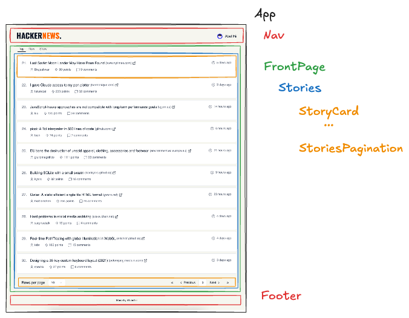

# Genesys takehome test


Hi, thank you for taking the time to review my take-home test!  
You can view the deployed version on [Github Pages](https://abelhii.github.io/reskin-test/).

or run it with npm or pnpm

## Quick start

with npm:

```bash
npm install
npm run dev
```

or with pnpm:

```bash
pnpm install
pnpm dev
```

## Tech Stack

- **Frontend:** React & TypeScript
- **Styling:** TailwindCSS, ShadCN
- **State Management:** React Query (Tanstack Query)
- **Validation:** zod (runtime API validation)
- **Testing:** Vitest, React Testing Library, MSW

## Component Architecture

Below is a simplified breakdown of the component hierarchy:



The application follows a top-down compositional structure:

- `App` – Layout wrapper
  - `Nav` – Contains the main logo and user profile
  - `FrontPage` – Responsible for Post type switching (Top / New / Show)
    - `Stories` – Handles pagination slicing and listing stories
      - `StoryCard` – Presentational component
      - `StoriesPagination` – Isolated client-side pagination logic
  - `Footer` – Static footer

## Assumptions

- The “Redesign the front page” requirement refers to the Hacker News homepage using `topstories.json`.
- The Hacker News API does not provide offset-based pagination. To ensure smooth UX and predictable caching behavior, client-side pagination was implemented on the fetched story IDs.
- API responses are assumed to be consistent in structure, but I've parsed the response through a zod schema and log a warning if it fails.
- More assumptions can be clarified on request.

## Testing Strategy

Focus on key UX behaviors and edge cases rather than 100% coverage:

- API fetching: `getStory`, `getStoryIds`
- Pagination: `usePagination` hook
- Components: `StoryCard`

## Minimum requirements

- [x] Redesign the front page
- [x] The user should be able to choose between new and top posts
- [x] The posts can be shown in any way you like (grid/list etc.)
- [x] How you handle **pagination** of the posts to display is up to you, but you should be able to load as many posts as the API permits while achieving a clean UX
- [x] add tests

## Possible Improvements

- Dark mode toggle
- Infinite scrolling as an alternative to pagination
- Go to specific page
- Store selected page state in search params

## Original prompt

Using Angular, React, Vue or other modern Javascript frameworks, utilise the HackerNews API to
create a redesigned hacker news web application.

Minimum requirements:

- Redesign the front page
- The user should be able to choose between new and top posts
- The posts can be shown in any way you like (grid/list etc.)
- How you handle pagination of the posts to display is up to you, but you should be able to
load as many posts as the API permits while achieving a clean UX

What we’re looking for:

- A clean, easy to use UI
- Use of best practices in the framework of your choice
- Readable and DRY code
- We value test coverage
- Make the code available in a Git-based source code repository e.g. Github. (Please make the
repository name a random string and avoid references to Genesys to prevent others copying
your code in the future.)
- State any assumptions that you made
- Please include a readme file for your solution in the repo

Aside from what is outlined above, you have free reign in any design decisions and
implementation details.

Naturally, StackOverflow and coding assistants like ChatGPT exist. While we cannot prevent you
from using these, we expect that you fully own any code you submit and can talk to it
comprehensively in a follow-up interview. In your day-to-day work, knowing your dependencies
and the rationale of design decisions is crucial, and we expect the same of you in your coding
challenge.
